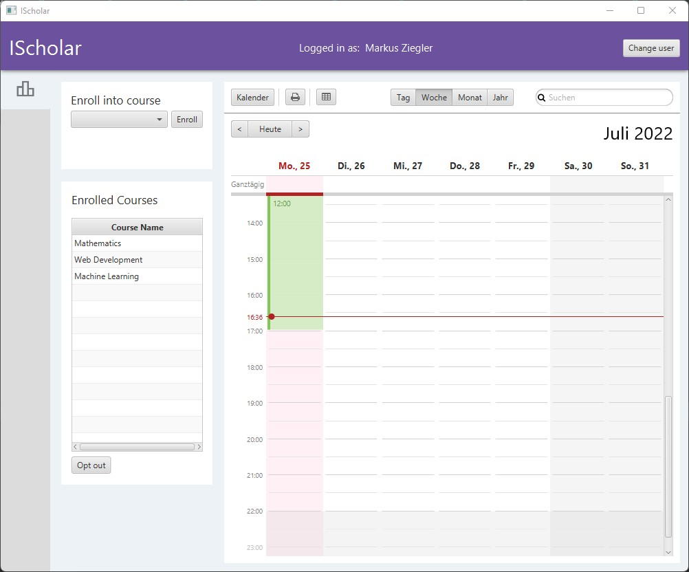
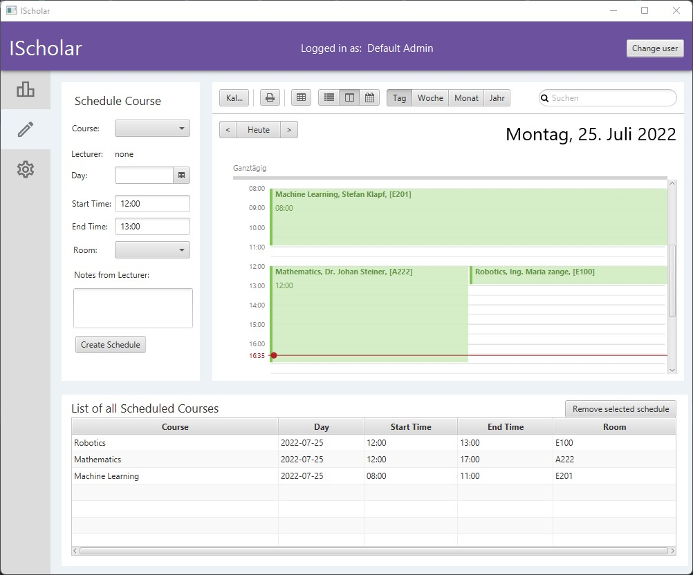
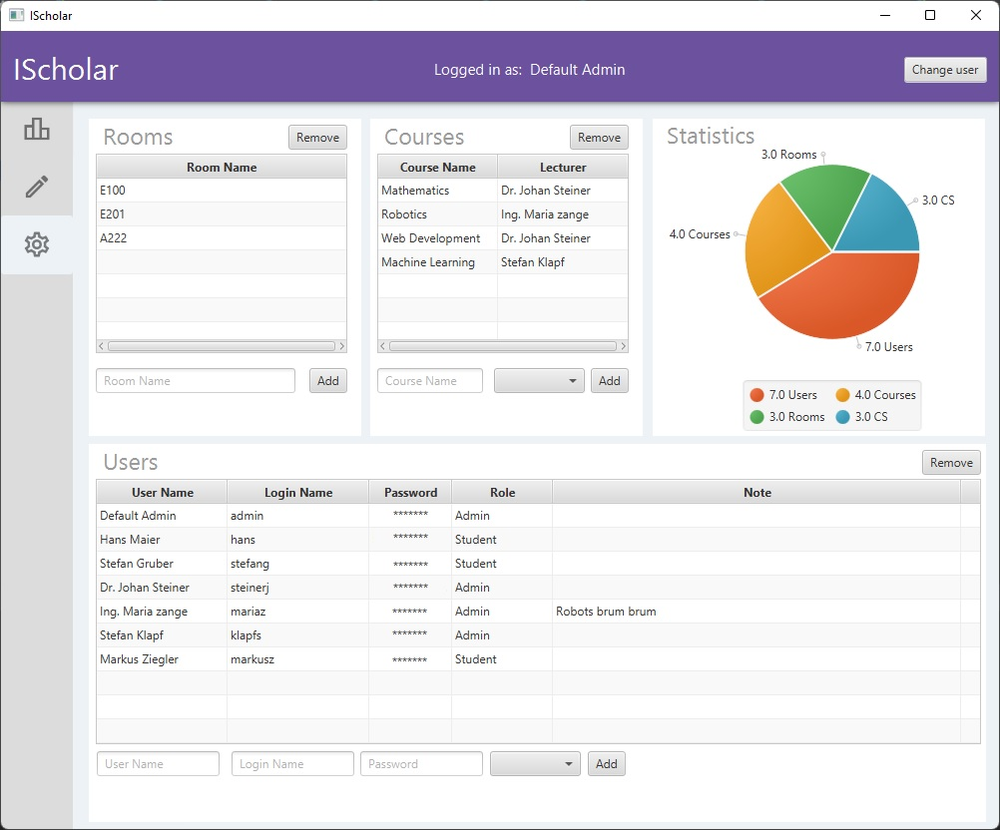

# IScholar
Author: Stefan Klapf

The application was developed during my bachelor studies at FH-JOANNEUM in 2019.
Developed with Java and JavaFX.


# Overview
A university and school courses scheduling application. 

The application allows you to manage and create courses, create schedules and manage students and teachers.

Features:
- Students can enroll in courses and receive a personal calendar with the respective course times.
- Administrative users can create courses and users.
- Assistants can create a timetable for each course.
- Overlapping courses are prevented when enrolling in a course.

# Media








# Development Setup
https://www.jetbrains.com/help/idea/javafx.html#create-project
Add to the vm options:
```
--module-path "C:/Tools/javafx-sdk-11.0.2/lib" --add-modules javafx.controls,javafx.fxml
```

Add the javafx library under project structure-> libraries

# Sources
```
Fonts: https://fonts.google.com/icons
```